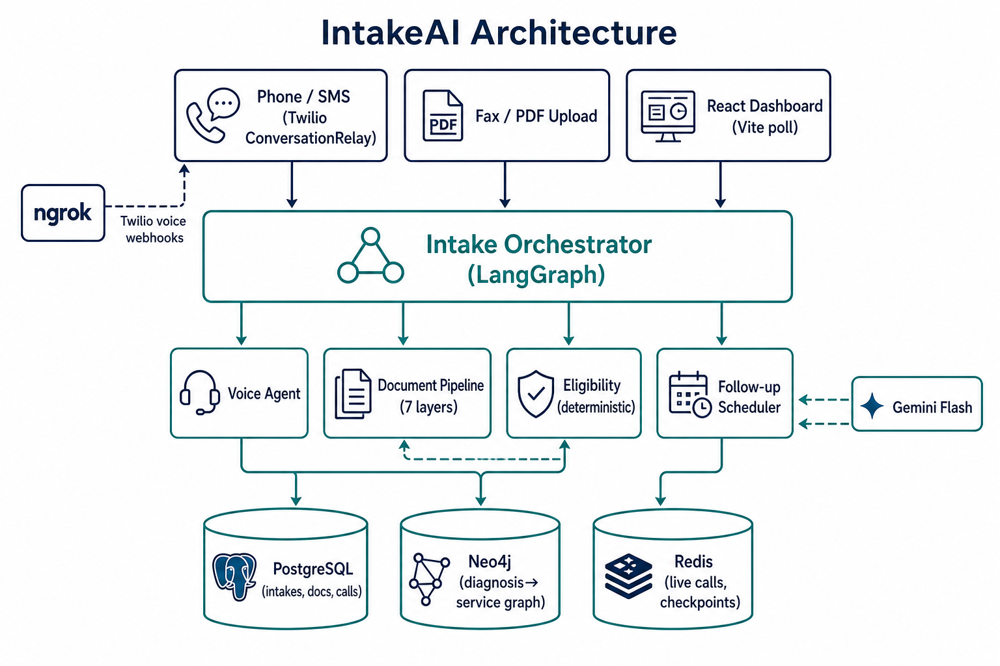
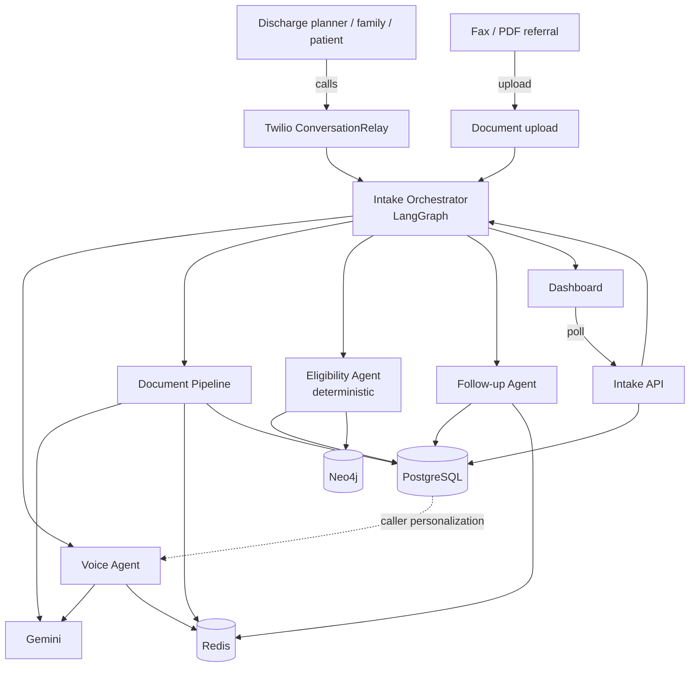
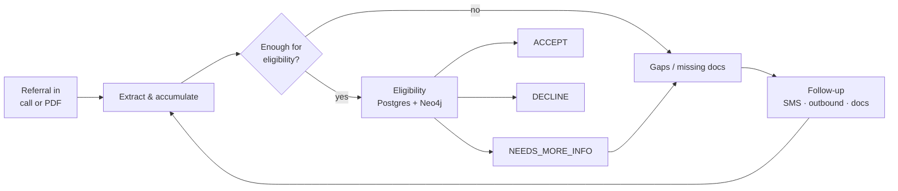

# IntakeAI — Arya Hackathon

**Intelligent patient intake agent for home health agencies**

## The problem

Home health agencies lose referrals because intake is slow: fax packets sit in queues, phones go unanswered after hours, and eligibility checks take coordinators ~70 minutes. Discharge planners call 3–5 agencies at once — **whoever answers first wins the patient**.

IntakeAI picks up the phone, reads referral PDFs, checks eligibility against real rules, closes gaps with follow-ups, and surfaces everything on a live dashboard.

---

## What we built

A conversational + document intake agent that:

- Answers **inbound calls** (provider, family, patient) via **Twilio ConversationRelay**
- Processes **fax/PDF** referral packets through a multi-layer extraction pipeline
- Runs **deterministic eligibility** (service area, insurance, diagnosis → service graph, caregiver match) — not an LLM guess
- Schedules **SMS / outbound follow-ups** for missing documents and gaps
- Shows live status on a **dashboard**

**Twilio is required** for sponsor eligibility. Reliability, guardrails, and security are prerequisites, not extras.

---

## Architecture

### System overview (image)

### System overview (Mermaid)

### Referral lifecycle (image)

### Referral lifecycle (Mermaid)

### Component map

| Component | Responsibility | Never does |
|-----------|----------------|------------|
| **Orchestrator (LangGraph)** | Owns workflow state; routes sub-agents; tracks referral lifecycle | Talk to callers; parse PDFs; query DBs directly |
| **Voice Agent** | Twilio ConversationRelay; extract structured fields; report to orchestrator | Decide eligibility; promise admission; give medical advice |
| **Document Pipeline** | Multi-layer PDF/fax extract, confidence, gaps | Decide eligibility |
| **Eligibility Agent** | Deterministic ACCEPT / DECLINE / NEEDS_MORE_INFO | Use an LLM to decide |
| **Follow-up Agent** | SMS, email, outbound calls, retries | Skip safety gates |
| **Dashboard** | Live visibility for demo / ops | Own business logic |

### Data layer

| Store | Role |
|-------|------|
| **PostgreSQL** | Intakes, documents, caregivers, calls, follow-ups |
| **Neo4j** | Diagnosis → service → certification coverage graph |
| **Redis** | Ephemeral call state, pipeline checkpoints, follow-up schedule |

Full step-by-step diagrams (including safety-gated call flow): [`docs/ARCHITECTURE.md`](./docs/ARCHITECTURE.md).

note: We had the conversation with Anand - reagrding the twillo - there was complaince issue so we couldn't submit the video. See [`docs/ELEVENLABS_MIGRATION.md`](docs/ELEVENLABS_MIGRATION.md) for the team's resulting decision to migrate off Twilio.

---

## Documentation

- [`PROJECT.md`](./PROJECT.md) — source of truth: problem, architecture, and build plan for IntakeAI.
- [`must-have.md`](./must-have.md) — non-negotiable safety layer (6 checks before every demo) and must-have features.
- [`docs/ARCHITECTURE.md`](./docs/ARCHITECTURE.md) — detailed architecture reference: diagrams and step-by-step flows.
- [`WORKFLOW.md`](./WORKFLOW.md) — plain-English, end-to-end walkthrough of both entry channels (voice call and fax/PDF) plus a situation-handling cheat sheet.
- [`data/README.md`](./data/README.md) — reference and synthetic seed data (ICD-10 subset, diagnosis/certification mappings, payer rules, caregiver roster, sample referrals), with sources and licensing notes.
- [`docs/ELEVENLABS_MIGRATION.md`](docs/ELEVENLABS_MIGRATION.md) — the Twilio → ElevenLabs migration plan (`apis/` scope; `local/` is out of scope per the workspace boundary, reconciled at merge day).
- See the [`docs`](./docs) folder for additional project documentation.
