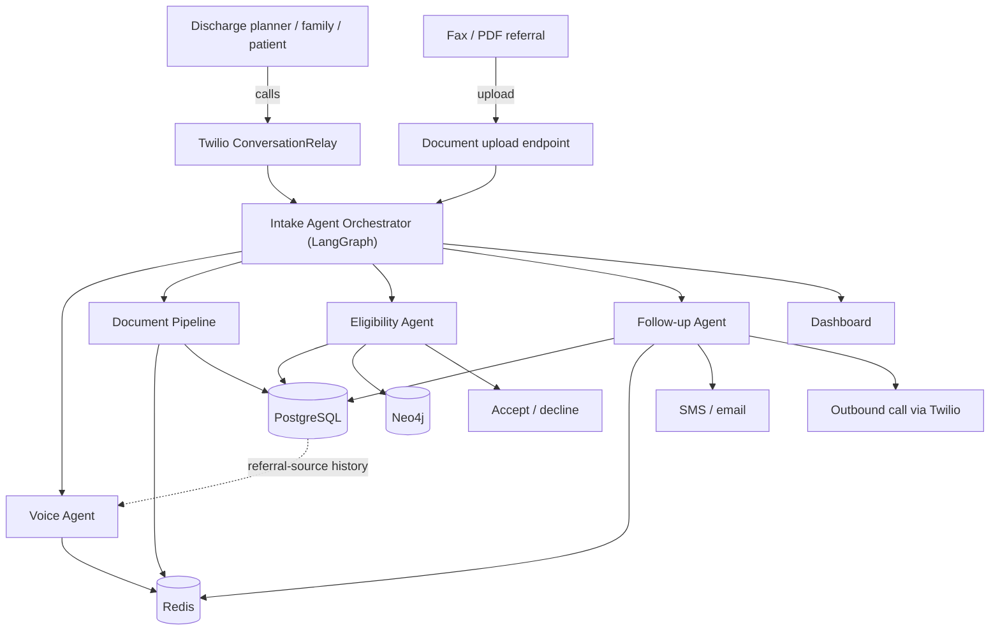
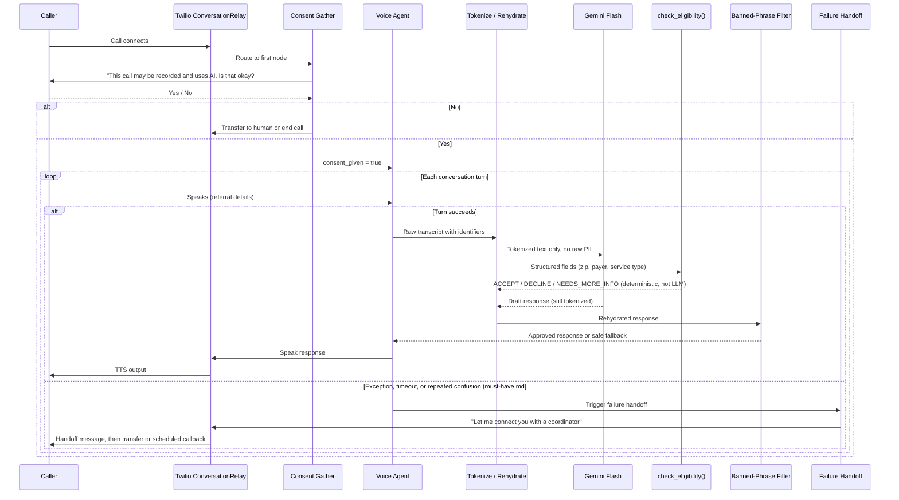
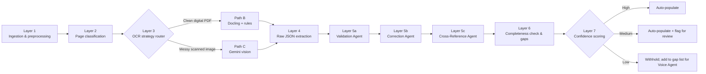
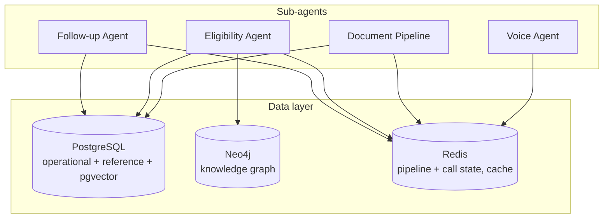
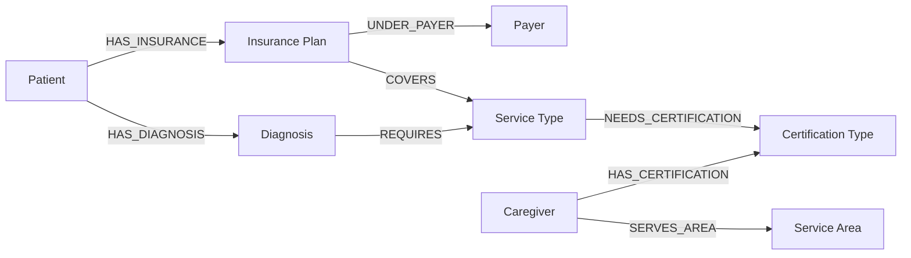
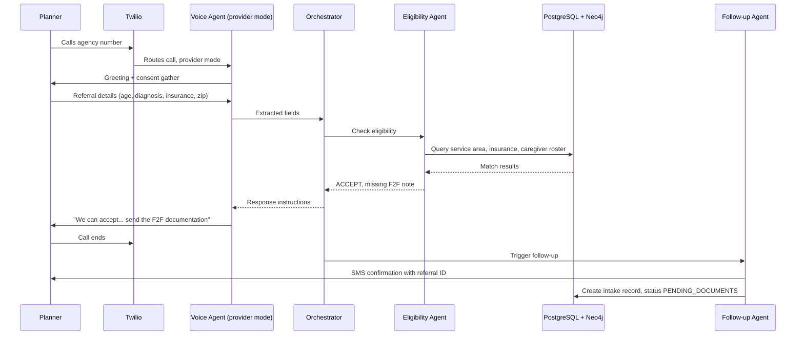
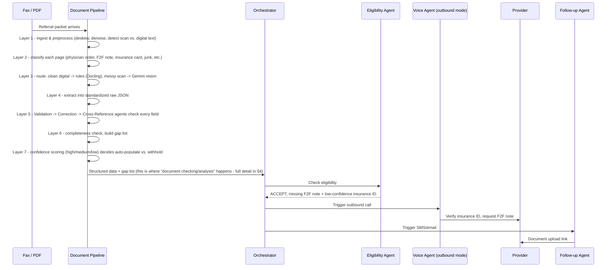
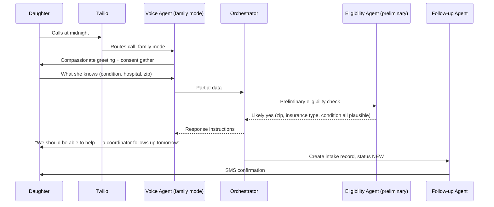
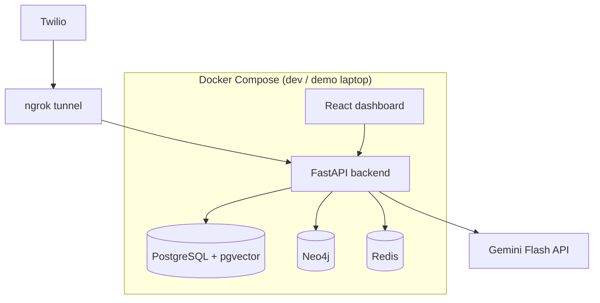

# Architecture — IntakeAI

This file is the detailed technical architecture reference: diagrams plus numbered step-by-step walkthroughs. It does not override anything — [`PROJECT.md`](PROJECT.md) remains the product and architecture source of truth, [`must-have.md`](must-have.md) remains the safety authority. This file exists to make both easier to build against by turning prose into diagrams a new developer can point at.

If this file and `PROJECT.md` ever disagree, `PROJECT.md` wins — update this file to match, not the other way around.

---

## 1. System overview



Steps:

1. A referral enters through one of two channels: a live call/SMS via Twilio, or a fax/PDF upload.
2. Both channels hand off to the Intake Agent Orchestrator (LangGraph state machine) — the only component that makes decisions.
3. The orchestrator delegates to exactly one of four sub-agents depending on what's needed: Voice Agent (talk), Document Pipeline (**read and analyze every fax/PDF here** — this is where all document checking/extraction/validation happens, via the 7-layer pipeline detailed in §4), Eligibility Agent (decide), Follow-up Agent (chase gaps).
4. Sub-agents read/write the data layer (PostgreSQL, Neo4j, Redis) but never decide anything themselves except the Eligibility Agent, whose decision is deterministic code, not an LLM call.
5. Outcomes are one of: accept/decline recorded in PostgreSQL, an SMS/email sent, an outbound call placed back through Twilio, or a dashboard update.
6. PostgreSQL's referral-source history feeds back into the Voice Agent on the next call from the same source — this is caller personalization (Feature 5 in `PROJECT.md`), shown as the dashed feedback line.

Full component detail: [`PROJECT.md` — System Architecture](PROJECT.md#system-architecture).

---

## 2. Component responsibilities

| Component | Responsibility | Never does |
|---|---|---|
| **Orchestrator (LangGraph)** | Owns workflow state; routes to sub-agents; makes the final admit/decline call; tracks referral lifecycle | Talk to callers directly; read documents directly; query databases directly |
| **Voice Agent** | Talks and listens via Twilio; extracts structured data from what the caller says; reports to the orchestrator | Decide eligibility; promise admission; give medical advice |
| **Document Pipeline** | Runs the 7-layer extraction (see §4) on every fax/PDF; produces structured JSON with confidence scores and a gap list | Decide eligibility; contact the caller |
| **Eligibility Agent** | Deterministically traverses PostgreSQL + Neo4j to return `ACCEPT` / `DECLINE` / `NEEDS_MORE_INFO` with reasons | Use an LLM to decide; guess when data is missing (returns `NEEDS_MORE_INFO` instead) |
| **Follow-up Agent** | Sends SMS/email, schedules outbound calls and retries, tracks gap-closure status | Decide eligibility; skip the safety-gated call flow on outbound calls |

---

## 3. Safety-gated call flow (non-negotiable)

This is the corrected, complete version of the call path — every box here is required by [`must-have.md`](must-have.md) Part 1.



Steps:

1. Twilio ConversationRelay answers and opens the WebSocket — STT starts streaming.
2. **Consent Gather runs first, before anything else.** A "no" routes to human transfer or a graceful end — never to continued data collection.
3. The Voice Agent talks and extracts data. It does not decide anything.
4. Every raw transcript passes through the **Tokenize wrapper** before it can reach Gemini Flash — identifiers become placeholders (`{{PATIENT_NAME}}`, `{{DOB}}`, etc.).
5. Eligibility runs as **deterministic code**, in parallel with Gemini Flash's reasoning, not inside it — it never asks the LLM to judge eligibility.
6. Gemini Flash's draft response is **rehydrated** with real values only inside the backend, then passed through the **banned-phrase filter** before it can reach TTS — this applies to every mode (provider, family, outbound), not only eligibility responses.
7. Twilio speaks the approved response; the loop repeats for the next turn.

Outbound calls (Feature 4) re-enter this exact same flow via Voice Agent Outbound mode — there is no separate, unguarded outbound path.

8. **Failure handling (no silent drop):** if anything mid-call raises an exception, times out, or the caller isn't understood after repeated attempts, that turn routes to the same handoff mechanism as a consent "no" — a spoken fallback ("Let me connect you with a coordinator") followed by a human transfer or a scheduled callback. No call path is allowed to end in silence. This is a distinct guarantee from consent (opt-out vs. failure), but both terminate at the same handoff code path. Full spec: [`must-have.md`](must-have.md) Part 1, guarantee #6.

Full spec, code-level implementation, and the pre-demo checklist: [`must-have.md`](must-have.md) Part 1.

---

## 4. Document pipeline (7 layers)



Steps:

1. **Layer 1** — deskew, denoise, contrast-enhance each page; detect scanned-image vs. digital-text pages.
2. **Layer 2** — classify each page (physician order, F2F note, discharge summary, med list, insurance card, junk cover sheet, etc.).
3. **Layer 3** — route by cleanliness: Path B (Docling + regex/keyword rules) for clean digital PDFs, Path C (Gemini Flash vision) for messy scans and handwriting.
4. **Layer 4** — both paths converge into a standardized raw JSON per page.
5. **Layer 5** — three agents run in sequence: Validation (format/range/lookup checks) → Correction (reasons about failures, assigns a confidence to each fix) → Cross-Reference (checks consistency of the same fact across pages, e.g. patient name on two documents).
6. **Layer 6** — diffs extracted data against the completeness checklist; every gap becomes a specific follow-up task.
7. **Layer 7** — every field gets a confidence score that decides its fate: high auto-populates, medium auto-populates but is flagged, low is withheld and added to the Voice Agent's gap-verification list.

Full detail per layer, including example correction scenarios: [`PROJECT.md` — Document Pipeline](PROJECT.md#document-pipeline-7-layers--agentic-review-loop).

---

## 5. Data layer: who queries whom



Steps / rules this enforces:

1. **Eligibility Agent is the only heavy Neo4j consumer** — it traverses the diagnosis → service type → certification → caregiver → service area path, plus the insurance → payer → coverage rule path. It also hits PostgreSQL for the caregiver roster and service-area/insurance-contract lookups.
2. **Redis is shared, not owned by one agent** — Voice Agent uses it for live call state, Document Pipeline uses it for pipeline-layer state, Eligibility Agent uses it to cache repeated zip+insurance checks, Follow-up Agent uses it for retry scheduling.
3. **Document Pipeline touches PostgreSQL** for reference/lookup tables (ICD-10 codes, medication dosage ranges) during Layer 5 validation, and for pgvector fuzzy matching (insurance plan names, med name variants, physician names) — pgvector is a PostgreSQL extension, not a separate store.
4. **Follow-up Agent writes to PostgreSQL** (event log, intake status) and to Redis (retry timers).
5. **No agent writes eligibility or acceptance decisions except the Eligibility Agent** — this is what keeps "can two agents accept the same patient" impossible.

Why 4 stores instead of 1, full schema-shaped rationale: [`PROJECT.md` — Database Architecture](PROJECT.md#database-architecture).

### Neo4j graph model (core traversal subset)

The full graph has 13 node types and 14 relationship types (see `PROJECT.md`). The subset that the eligibility check actually walks on every call:



This is the "6-hop path" referenced in `PROJECT.md`: diagnosis → required service → required certification → a caregiver holding that certification → serving the patient's area, cross-checked against the insurance plan's coverage of that service type.

---

## 6. End-to-end request lifecycles

### Flow 1 — Discharge planner calls the agency



### Flow 2 — Fax referral arrives



### Flow 3 — Family member calls



Full prose walkthroughs (with exact spoken lines): [`PROJECT.md` — Intake Workflow](PROJECT.md#intake-workflow--end-to-end).

---

## 7. Deployment topology (hackathon build)



Everything runs locally via Docker Compose except Twilio and the Gemini API, which are external services reached through an ngrok tunnel (Twilio needs a public webhook URL to reach the local FastAPI WebSocket server). Account setup for each external dependency: [`PROJECT.md` — Accounts & Credentials Setup](PROJECT.md#accounts--credentials-setup).

---

## 8. Module layout (actual — kept in sync with reality)

Two parallel trees exist, governed by CLAUDE.md "Workspace Boundaries": the **canonical integration tree** below, and `local/` (the autonomous coder agent's workspace, reconciled at merge time per [`MERGE_DAY_RECONCILIATION.md`](MERGE_DAY_RECONCILIATION.md)).

```
apis/api_intake/            ← canonical backend (one folder per API)
  app/
    routes/                  ← Person 1 (health, /eligibility-check, Twilio webhook + ConversationRelay WS)
    safety/                  ← shared, non-negotiable (must-have.md guarantees 1-6 as code)
    agents/                  ← Person 3 (eligibility_agent facade, knowledge_graph traversal, mode_router)
    eligibility/             ← Person 3 (checks, decision engine, reference_data, live_sources PG, status_writer)
  tests/                     ← full suite incl. make safety gate + 4-scenario acceptance test
ai-agents/
  voice-agent/               ← Person 1 (provider/family/outbound mode system prompts)
infra/
  neo4j/load_seed.py         ← Person 3 (knowledge-graph seed loader from data/)
  postgres/seed_demo_data.py ← Person 3 (intakeai_demo seeder from data/)
apps/dashboard/              ← Person 3 (React dashboard, Vite + TS)
data/                        ← canonical seed source (see data/README.md)
local/                       ← autonomous agent workspace (orchestrator, follow-up, guardrails; DO NOT TOUCH — merges per MERGE_DAY_RECONCILIATION.md)
```

Follow-up + orchestrator live in `local/backend/` until merge day; their canonical seam is the `EligibilityClient` protocol ↔ `POST /eligibility-check` contract.

---

## 9. Where to look for more detail

| Question | Look in |
|---|---|
| Why does this product exist, who's the customer | `PROJECT.md` — The Problem, The Solution |
| What must never break, safety checklist | `must-have.md` Part 1 |
| Which features are must-have vs. nice-to-have | `must-have.md` Part 2 |
| Exact database schema fields | `PROJECT.md` — Data Model |
| Hackathon rules, judging criteria, compliance checklist | `PROJECT.md` — Official Challenge Brief |
| Accounts and credentials needed | `PROJECT.md` — Accounts & Credentials Setup |
| Hour-by-hour build plan and phase ownership | `PROJECT.md` — Hackathon Build Plan |
| Team collaboration protocol, task templates | `CLAUDE.md` |
