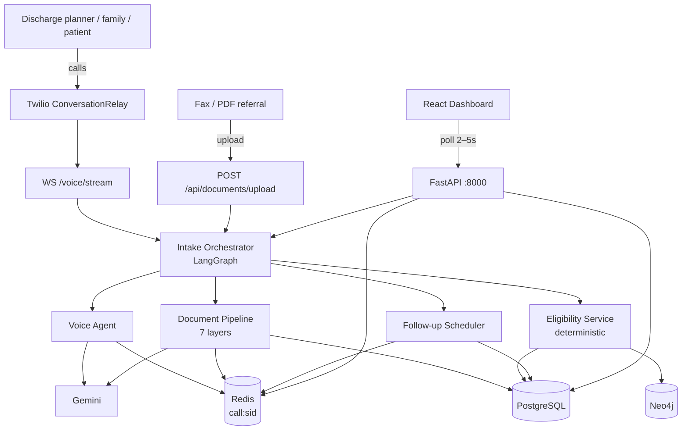
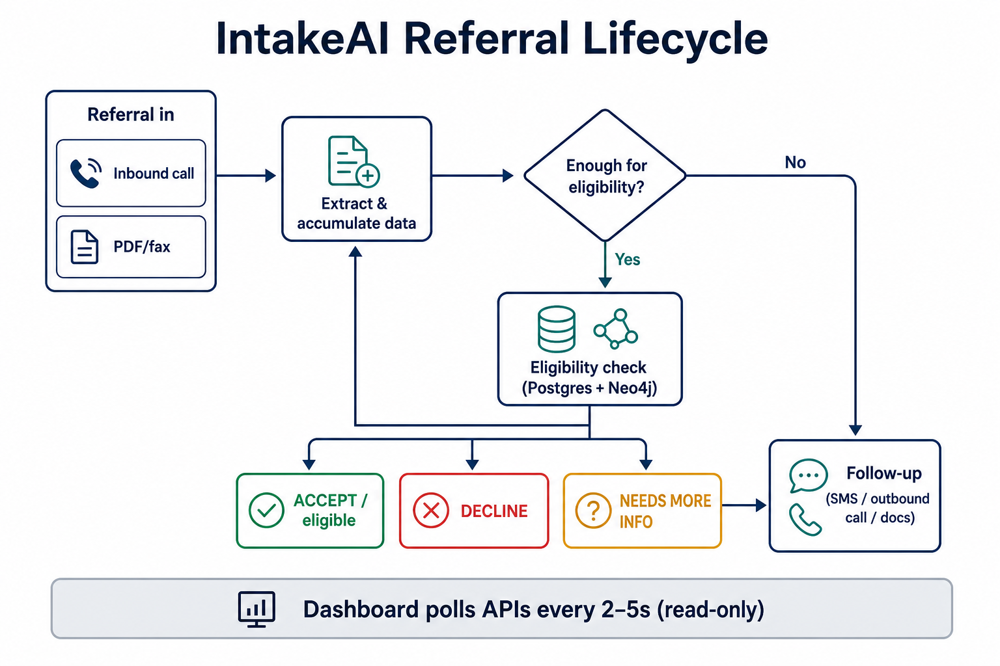
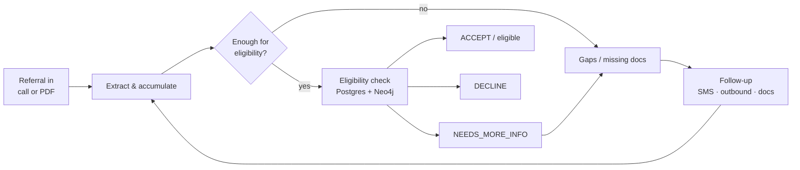
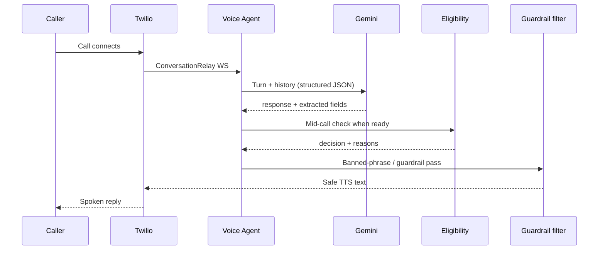

# IntakeAI (`local/`)

Intelligent patient intake for home health agencies — hackathon demo stack for **AI Healthcare Hack NYC** (Twilio AI Startup Searchlight × Arya Health).

This folder is the runnable Phase 1–6 application: FastAPI backend, Docker data stores, Twilio + Gemini integrations, and a read-only React dashboard.

| | |
|---|---|
| **Branch** | `local` |
| **API** | http://localhost:8000 |
| **Dashboard** | http://localhost:5173 |
| **Version** | `0.6.0` (`backend/main.py`) |

Related docs: [`PROJECT.md`](PROJECT.md) (product + architecture narrative), [`PHASE_1_SPEC.md`](PHASE_1_SPEC.md)–[`PHASE_6_SPEC.md`](PHASE_6_SPEC.md), repo [`docs/ARCHITECTURE.md`](../docs/ARCHITECTURE.md).

---

## Table of contents

1. [What it does](#what-it-does)
2. [Architecture](#architecture)
3. [Phases 1–6](#phases-1–6)
4. [Repository layout](#repository-layout)
5. [Prerequisites](#prerequisites)
6. [Quick start](#quick-start)
7. [Configuration](#configuration)
8. [API surface](#api-surface)
9. [Dashboard](#dashboard)
10. [Demo script](#demo-script)
11. [Tests](#tests)
12. [Safety principles](#safety-principles)

---

## What it does

IntakeAI answers the phone, reads fax/PDF referral packets, checks eligibility against real rules (service area, insurance, diagnosis → service graph, caregiver match), closes gaps with follow-ups, and shows the whole pipeline on a live dashboard.

**Channels**

- Inbound / outbound voice via **Twilio ConversationRelay**
- Fax/PDF via **document upload + 7-layer pipeline**
- SMS / scheduled follow-ups
- Read-only **React dashboard** (polls APIs; no business logic in the UI)

**Core principle**

The **LangGraph orchestrator** decides. Sub-agents talk, extract, or chase gaps. **Eligibility is deterministic code** over PostgreSQL + Neo4j — not an LLM guess.

---

## Architecture

### Overview (generated)


### Overview (Mermaid)



### Referral lifecycle (generated)



### Referral lifecycle (Mermaid)



### Component responsibilities

| Component | Does | Does not |
|-----------|------|----------|
| **Orchestrator** (`backend/agents/orchestrator.py`) | Own workflow state; route sub-agents; track intake lifecycle | Speak to callers; parse PDFs; query DBs directly |
| **Voice Agent** (`backend/agents/voice_agent.py`) | ConversationRelay turns; extract fields; Redis live state; mid-call eligibility handoff | Promise admission; give medical advice |
| **Document Pipeline** (`backend/pipeline/`, `workers/document_processor.py`) | 7-layer extract + confidence + gaps | Decide eligibility |
| **Eligibility** (`services/eligibility_service.py`) | Deterministic ACCEPT / DECLINE / NEEDS_MORE_INFO | Use LLM to decide |
| **Follow-up** (`workers/followup_scheduler.py`) | Poll Redis ZSET; SMS / outbound / retries | Skip safety gates |
| **Dashboard** (`frontend/`) | Poll and display | Create records, upload, or decide |

### Data stores

| Store | Role |
|-------|------|
| **PostgreSQL** (+ pgvector image) | Intakes, documents, caregivers, call records, follow-ups |
| **Neo4j** | Diagnosis → service → certification coverage graph |
| **Redis** | Active `call:{sid}` payloads, pipeline checkpoints, follow-up schedule |

Compose file runs **databases only** — API and UI run on the host.

### Safety-gated voice path (Mermaid)



---

## Phases 1–6

| Phase | Deliverable |
|-------|-------------|
| **1** | Docker Compose (Postgres, Neo4j, Redis), SQL/Cypher schema, JSON seeds, `sample_data` loader |
| **2** | Guardrail JSON + `GuardrailService`, prompt templates, unit tests |
| **3** | SQLAlchemy models, Pydantic schemas, REST APIs, voice stubs |
| **4** | 7-layer document pipeline, Redis checkpoints, follow-up scheduler, sample PDFs |
| **5** | LangGraph orchestrator, ConversationRelay voice agent, mid-call eligibility, `/voice/test` |
| **6** | Vite + React + Tailwind read-only dashboard + call/doc read APIs |

---

## Repository layout

```
local/
├── docker-compose.yml
├── .env.example
├── requirements.txt
├── PROJECT.md
├── PHASE_*_SPEC.md
├── docs/
│   ├── architecture-overview.png
│   └── referral-lifecycle.png
├── backend/
│   ├── main.py                 # FastAPI app
│   ├── api/                    # Routers (thin)
│   ├── agents/                 # Orchestrator, voice, validation…
│   ├── services/               # Business logic
│   ├── workers/                # Doc processor, follow-up scheduler
│   ├── pipeline/               # Extraction layers
│   ├── models/                 # Tables, schemas, DB clients
│   ├── db/                     # Init SQL, seed, sample_data.py
│   ├── prompts/
│   └── tests/
├── frontend/                   # Dashboard
│   └── src/
│       ├── App.jsx
│       ├── api/client.js
│       └── components/
├── data/                       # JSON rules + sample_referrals/*.pdf
├── scripts/                    # seed_databases.ps1 / .sh
└── uploads/                    # Runtime uploads (gitignored)
```

---

## Prerequisites

- Docker Desktop (Compose v2)
- Python 3.11+ (or conda env with project deps)
- Node.js 20+ (for dashboard)
- Accounts/keys as needed: **Twilio**, **Gemini**, **ngrok** (for public WSS)

---

## Quick start

All commands from `local/` unless noted.

### 1. Databases

```powershell
docker compose up -d
# Wait until healthy, then seed:
.\scripts\seed_databases.ps1
# Or:
$env:PYTHONPATH = (Get-Location).Path
python -m backend.db.sample_data
```

### 2. Environment

```powershell
Copy-Item .env.example .env
# Edit .env — set GEMINI_API_KEY, TWILIO_*, NGROK_URL
python -m pip install -r requirements.txt
```

### 3. API

```powershell
$env:PYTHONPATH = (Get-Location).Path
python -m uvicorn backend.main:app --reload --host 0.0.0.0 --port 8000
```

Health check: http://localhost:8000/ → `postgres` / `neo4j` / `redis` should be `"ok"`.

### 4. Dashboard

```powershell
cd frontend
npm install
$env:VITE_TWILIO_PHONE = "+1XXXXXXXXXX"   # shown in header
npm run dev
```

Open http://127.0.0.1:5173/ — Vite proxies `/api` and `/voice` to `:8000`.

### 5. Twilio (live calls)

1. Start ngrok to port `8000` and set `NGROK_URL` in `.env`.
2. Point the Twilio number’s voice webhook to `{NGROK_URL}/voice/inbound`.
3. ConversationRelay streams to `wss://{ngrok-host}/voice/stream`.

**Offline fallback:** `POST /voice/test` with JSON turns (see Phase 5 tests / OpenAPI docs at `/docs`).

---

## Configuration

From [`.env.example`](.env.example):

| Variable | Purpose |
|----------|---------|
| `TWILIO_ACCOUNT_SID` / `AUTH_TOKEN` / `PHONE_NUMBER` | Telephony |
| `NGROK_URL` | Public base URL for TwiML + WSS |
| `GEMINI_API_KEY` | Voice + document LLM calls |
| `POSTGRES_*` | SQLAlchemy async engine |
| `NEO4J_URI` / user / password | Graph eligibility |
| `REDIS_URL` | Live calls + workers |
| `APP_PORT` | Default `8000` |

Frontend-only: `VITE_TWILIO_PHONE` (display string for the dashboard header).

---

## API surface

Interactive docs: http://localhost:8000/docs

| Prefix | Highlights |
|--------|------------|
| `GET /` | Health (Postgres, Neo4j, Redis) |
| `/api/intake` | Create / list / get / update / status |
| `/api/eligibility` | `POST /check`, service areas, insurance |
| `/api/caregivers` | Match + roster |
| `/api/documents` | Upload, `by-intake/{id}`, `/{id}/status\|extraction\|file` |
| `/api/calls` | `GET /active` (Redis), `GET /by-intake/{id}` |
| `/api/followup` | Create, `by-intake/{id}`, status |
| `/voice` | `POST /inbound`, `WS /stream`, `POST /test`, `POST /outbound` |

Upload a sample PDF:

```powershell
curl -X POST "http://localhost:8000/api/documents/upload" `
  -F "file=@data/sample_referrals/referral_complete.pdf"
```

---

## Dashboard

Read-only UI under `frontend/`. Views: **Pipeline** · **Referral detail** · **Live calls**.

| View | Polling |
|------|---------|
| Pipeline | Intakes + active calls every **3s** |
| Detail | Intake **3s**, follow-ups **5s**, docs while processing |
| Live monitor | Active **2s** / idle **5s** |
| Health dot | `GET /` every **~5s** |

No React Router, Axios, auth, or upload UI — by design (Phase 6).

---

## Demo script

1. Clear or use seeded data; confirm health is green on the dashboard.
2. **Provider call** (or `POST /voice/test`) — watch Live Call Monitor fill fields.
3. **Fax** — upload `data/sample_referrals/referral_complete.pdf`; watch pipeline status / detail docs.
4. **Family / gap follow-up** — incomplete referral → follow-up actions.
5. **Decline path** — zip **`90210`** (out of service area) → declined with reasons.
6. Walk **Pipeline → Detail**: confidence dots, gaps, transcripts, eligibility, caregivers.

Sample PDFs: `data/sample_referrals/` (`referral_complete`, `handwritten`, `poor_quality`, `missing_f2f`). Regenerate with `python data/sample_referrals/generate_samples.py`.

---

## Tests

From `local/` with Compose up and `PYTHONPATH` set:

```powershell
$env:PYTHONPATH = (Get-Location).Path

python -m unittest discover -s backend/tests -v

python -m unittest backend.tests.test_guardrails -v
python -m unittest backend.tests.test_api_smoke -v
python -m unittest backend.tests.test_pipeline_layers -v
python -m unittest backend.tests.test_pipeline_e2e -v
python -m unittest backend.tests.test_orchestrator -v
python -m unittest backend.tests.test_voice_agent -v
```

```powershell
cd frontend
npm run build
```

---

## Safety principles

- Eligibility is **never** an LLM decision.
- Voice output passes **guardrails** (banned phrases, no premature admission, no medical advice).
- Dashboard adds **zero** business logic — it only displays API/Redis state.
- Seeds and samples are **demo/fake** data only.

See [`must-have.md`](../must-have.md) at the repo root for the full safety checklist.

---

## License / hackathon note

Built for a one-day in-person hackathon sprint. Prefer the `local` branch for this stack; do not commit secrets (`.env` is gitignored).
